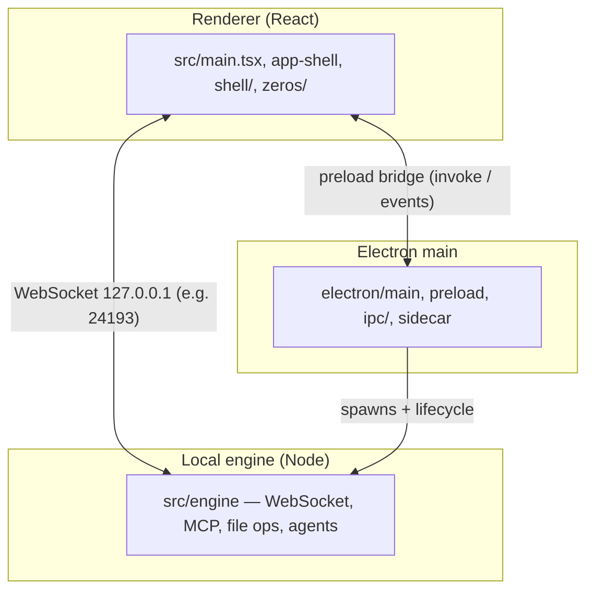

# Zeros

**Zeros** is a local-first **Mac app** (Electron) for design-led work on real codebases: open a project, inspect the live UI, edit styles, chat with coding agents (via native CLI adapters), and use Git, terminal, and environment panels—without giving up your files to a hosted IDE.

The repository root is the main app. Sibling products (for example **0colors**, **0accounts**, **0research**) also live in this monorepo under `apps/` and `website/`.

- **Product walkthrough (non-technical):** [docs/Zeros-Structure/00-Start-Here.md](docs/Zeros-Structure/00-Start-Here.md)
- **How the Mac app is wired:** [docs/Zeros-Structure/03-Mac-App-Architecture.md](docs/Zeros-Structure/03-Mac-App-Architecture.md)
- **Full doc index and labels:** [docs/Zeros-Structure/12-Doc-Index-And-Labels.md](docs/Zeros-Structure/12-Doc-Index-And-Labels.md)

## Architecture (three processes)

The UI you see is **not** the whole app. It is two cooperating native layers plus a local **engine** process that talks to your repo and to agent CLIs.



| Layer | Role |
| --- | --- |
| **Main** | Window, menus, IPC, keychain, PTY, Git, sidecar boot, deep links, updater. |
| **Renderer** | Three-column UI: project/chat sidebar, agent chat, design workspace and panels. |
| **Engine** | Project index, style/CSS writing, `.0c` project handling, MCP server for tools, agent subprocess management. |

## Requirements

- **macOS** (this repo targets the Mac app first).
- **Node.js** 20+ and **pnpm** (see `package.json` and `pnpm-lock.yaml`).

## Develop the Mac app

```bash
pnpm install
pnpm electron:dev
```

This runs the Vite dev server, recompiles the Electron main process, and launches Electron against `http://localhost:5173`. Use **pnpm** for other scripts in `package.json` (e.g. `electron:build` for a packaged app).

**Browser-only UI** (no native shell) for quick UI work:

```bash
pnpm dev
```

Native APIs are stubbed or limited in that mode; the real product is the Electron flow above.

## Repository layout (high level)

| Path | What |
| --- | --- |
| `electron/` | Main process, preload, IPC command handlers, sidecar manager. |
| `src/shell/`, `src/app-shell.tsx` | App chrome: columns, panels, chat shell. |
| `src/zeros/` | Design workspace UI, settings, shared components. |
| `src/engine/` | Local sidecar: server, WebSocket, MCP, agents. |
| `src/native/` | Renderer facade over native IPC. |
| `docs/Zeros-Structure/` | Up-to-date product and architecture documentation. |
| `apps/0colors/` | 0colors (token/color system; integration in progress). |
| `website/`, `servers/` | 0accounts, 0research, and related services. |

## License

MIT — see the `license` field in `package.json`.
